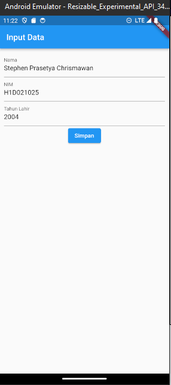
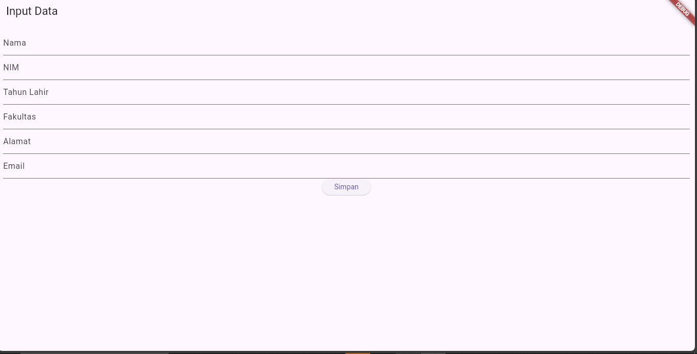
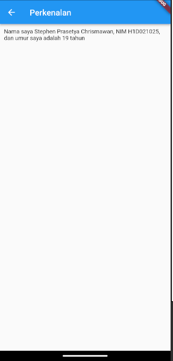
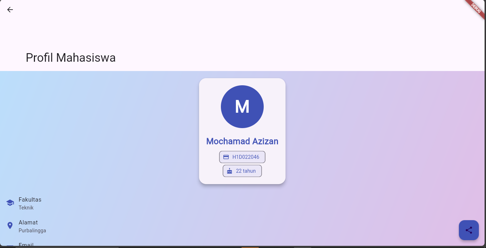

# Tugas Pertemuan 2

Fork dan clone repository ini, lalu jalankan perintah 
```
flutter pub get
```
Buatlah tampilan form yang berisi nama, nim, dan tahun lahir pada file `ui/form_data.dart`, lalu buatlah tampilan hasil dari input data tersebut pada file `ui/tampil_data.dart`

JELASKAN PROSES PASSING DATA DARI FORM MENUJU TAMPILAN DENGAN FILE `README.md`

Buat tampilan semenarik mungkin untuk dilihat.


Nama : Mochamad Azizan

NIM : H1D022046

Shift Baru: E

Penjelasan source code:
Source code di atas merupakan sebuah aplikasi berbasis Flutter yang menampilkan profil mahasiswa dengan berbagai informasi tambahan. Berikut adalah penjelasan detail dari kode tersebut:

### 1. **Import Flutter Material**
```dart
import 'package:flutter/material.dart';
```
Kode ini mengimpor pustaka `Material` dari Flutter, yang menyediakan berbagai widget dasar dan komponen UI sesuai dengan standar desain Material.

### 2. **Deklarasi Class TampilData**
```dart
class TampilData extends StatelessWidget {
```
`TampilData` adalah class yang meng-extend `StatelessWidget`, yang berarti widget ini tidak akan berubah setelah dibuat (immutable). Widget ini digunakan untuk menampilkan data statis profil mahasiswa.

### 3. **Deklarasi Field dalam Class**
```dart
final String nama;
final String nim;
final int tahun;
final String fakultas;
final String alamat;
final String email;
```
Field tersebut digunakan untuk menyimpan data profil mahasiswa, yaitu nama, NIM, tahun lahir, fakultas, alamat, dan email. Field ini akan diisi melalui constructor.

### 4. **Constructor dengan Parameter**
```dart
const TampilData({
    Key? key,
    required this.nama,
    required this.nim,
    required this.tahun,
    required this.fakultas,
    required this.alamat,
    required this.email,
  }) : super(key: key);
```
Constructor ini digunakan untuk menerima data profil mahasiswa dari widget induknya. Semua field bersifat `required`, sehingga saat membuat instance widget, parameter tersebut harus diberikan.

### 5. **Method build**
```dart
@override
Widget build(BuildContext context) {
```
Method `build` mendefinisikan bagaimana tampilan widget ketika dirender di layar.

#### 6. **Menghitung Umur**
```dart
final int umur = DateTime.now().year - tahun;
```
Kode ini menghitung umur mahasiswa berdasarkan tahun saat ini dikurangi dengan tahun lahir yang diberikan dalam parameter.

#### 7. **Scaffold dan Struktur Halaman**
```dart
return Scaffold(
      body: CustomScrollView(
```
`Scaffold` digunakan sebagai struktur dasar halaman. Dalam hal ini, halaman terdiri dari dua bagian utama:
- **AppBar**: Menggunakan `SliverAppBar` yang memiliki gambar latar belakang dari URL random dan teks "Profil Mahasiswa".
- **Konten**: Menggunakan `SliverToBoxAdapter` untuk menampilkan profil mahasiswa di dalam sebuah container dengan dekorasi gradient.

#### 8. **Profile Card**
```dart
_buildProfileCard(nama, nim, umur),
```
Widget `_buildProfileCard` menampilkan informasi utama dari profil mahasiswa, seperti:
- **CircleAvatar**: Menampilkan huruf inisial dari nama mahasiswa di dalam lingkaran.
- **Text**: Menampilkan nama lengkap mahasiswa.
- **Info Chips**: Menampilkan NIM dan umur menggunakan `Chip`.

#### 9. **Informasi Tambahan**
```dart
_buildAdditionalInfo(),
```
Widget `_buildAdditionalInfo` digunakan untuk menampilkan informasi tambahan seperti fakultas, alamat, dan email dalam bentuk `ListTile`, yang menampilkan ikon, judul, dan subjudul (isi informasi).

#### 10. **FloatingActionButton**
```dart
floatingActionButton: FloatingActionButton(
        onPressed: () {
          ScaffoldMessenger.of(context).showSnackBar(
            SnackBar(content: Text('Fitur berbagi belum diimplementasikan')),
          );
        },
```
Terdapat sebuah `FloatingActionButton` yang berfungsi sebagai tombol untuk berbagi profil mahasiswa. Saat ditekan, tombol ini akan menampilkan pesan `Snackbar` yang menyatakan bahwa fitur berbagi belum diimplementasikan.

#### 11. **Fungsi Private Widget**
- `_buildProfileCard`: Membuat tampilan profil utama dalam bentuk kartu (card) yang berisi avatar, nama, NIM, dan umur mahasiswa.
- `_buildInfoChip`: Membuat chip kecil yang berisi informasi berupa ikon dan label (misalnya, NIM atau umur).
- `_buildAdditionalInfo`: Menampilkan informasi tambahan seperti fakultas, alamat, dan email dalam bentuk `ListTile` dengan ikon di sebelah kiri.

### Penutup
Kode ini membentuk tampilan UI untuk profil mahasiswa, lengkap dengan avatar, nama, NIM, umur, fakultas, alamat, dan email. Aplikasi ini juga menggunakan beberapa komponen Flutter seperti `CustomScrollView`, `SliverAppBar`, `Card`, dan `ListTile` untuk menyusun UI secara responsif dan rapi.
## Screenshot
Contoh :


# Tugas2PraktikumMobile
